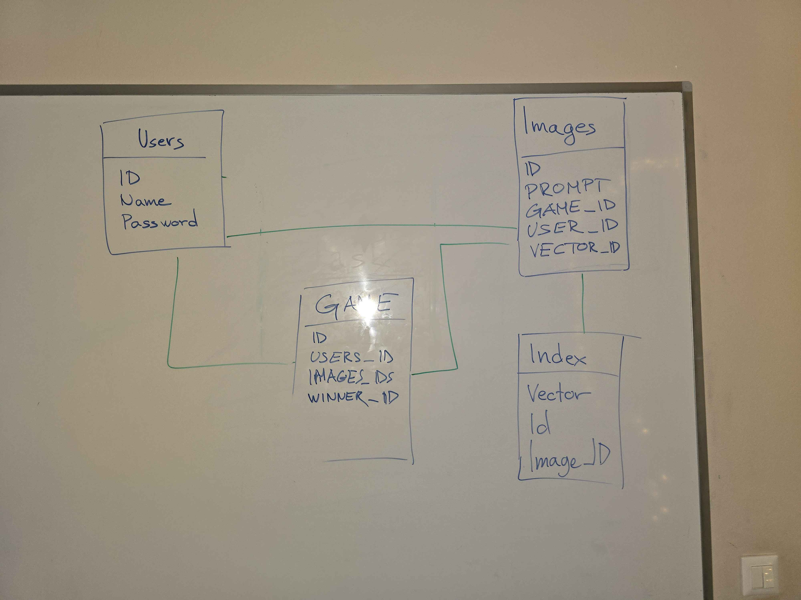

# Image Game Project

## Overview
An interactive game combining LLMs and image generation AI. Players compete to recreate a randomly generated image using text prompts.

## Prerequisites
- Ollama LLM (Using 3.1)
- OpenAI API Key (Set as environment variable: `OPENAI_API_KEY`)
> Note: It can also be run locally by setting LOCAL to true without OpenAI but then only a default image will show up. For testing purposes only.

## Diagram


## Setup

### Backend
```bash
git clone https://github.com/MaiMarincic/ImageGame.git
cd ImageGame/backend
pip install -r requirements.txt
python server.py
```

### Frontend
```bash
cd University/PodatkovneBaze/ImageGame/frontend/
python -m venv venv
source venv/bin/activate  # On Windows use `venv\Scripts\activate`
pip install -r requirements.txt
streamlit run app.py
```

### Changing Number of Players
To change the number of players, modify the `NUMBER_OF_PLAYERS` constant in the configuration file.

## API Usage

```bash
curl -X POST http://localhost:5000/add_player -H "Content-Type: application/json" -d '{"player_name": "Alice"}'
curl -X POST -H "Content-Type: application/json" -d '{"user_id": "7"}' http://localhost:5000/add_player
curl http://localhost:5000/game_status
curl -X POST http://localhost:5000/send_prompt -H "Content-Type: application/json" -d '{"player_id": "0", "player_prompt": "A cat riding a bicycle"}'
curl http://localhost:5000/get_images
curl -X POST http://localhost:5000/send_vote -H "Content-Type: application/json" -d '{"player_id": "0", "voted_for_id": "1"}'
```

## Database Viewer CLI

### Setup
```bash
pip install click
```

### Usage
```bash
python cli.py users
python cli.py games
python cli.py game-details [GAME_ID]
python cli.py image-details [IMAGE_ID]
```
